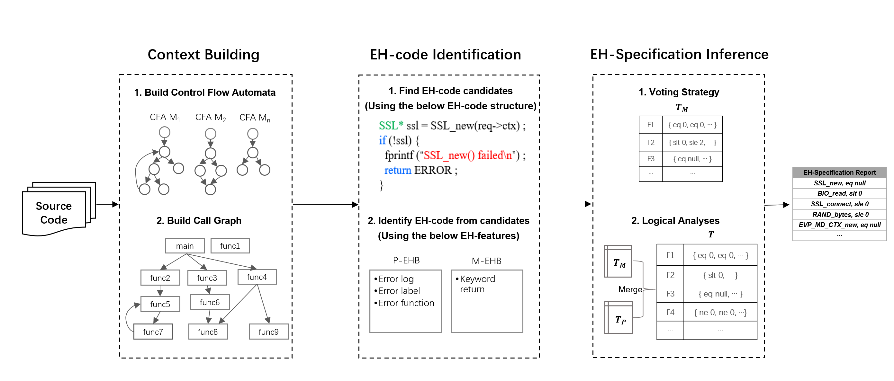

# An Empirical Study of EH-bugs in C language

### What is in this repo?

- Empirical Study
  - [GitGrabber](empirical_study/Gitgrabber): a tool to extract commits based on the pre-defined keyword matching
  - Commits related to EH-bugs in the studied projects (study period from 2014-01-01 to 2019-01-01) 
- Prototype Tool: Ares
  - Evaluation Process ([evaluation_data](evaluation_data))
    - 19 real world projects
  - New bugs found by Ares([bugs](evaluation_data/new_bugs))
  - Tools
    - build-capture
    - Ares toolkit ([tool](tool))

### Empirical Study

To better understand the properties of EH-bugs occur in real C projects, we manually studied six open-source projects within the study period from 2014-01-01 to 2019-01-01, as shown in the following table. These histories are chosen because of the ongoing development and because they are frequently mentioned in diverse bug detection works. In total, we have studied approximately 33.9K commits.

|      Projects      |  Commits |  Candidate EH-bug commits  |  Confirmed EH-bug commits | EH-bug fixes
| :---------------: | ---------: | ---------: | ---------: |---------: 
|      OpenSSL      |     11534 | 262 | 152 | 412
|      Curl       |       6646 | 120 | 56 | 123
|      PostgreSQL        |    10237 |  86 | 21 | 51
|      Open-vm-tools        |    1157 |  8 | 0 | 0
|      keepalived      |      2898 |  36 | 13 | 39  
|     irssi     |      1434 | 12 | 6 | 7
|   Total  |  33906 | 524 | 248 | 632

#### GitGrabber

[GitGrabber](empirical_study/Gitgrabber) is a tool to extract commits based on the pre-defined messgaes.  To help readers extract the commits message, changed files and patch files, we open source our GitGrabber tool. Any problems on GitGrabber, please feel free to contact us!

We describe the [usages](empirical_study/Gitgrabber/README.md) of the tool in detail.  We defined our info at the [config.yml](empirical_study/Gitgrabber/config.yml) file, then GitGrabber can extract the commits that matching our pre-defined info.  First, as shown in the [config.yml](empirical_study/Gitgrabber/config.yml) file, we extracted the bug fix related commits using the pre-defined the keywords (bug, fix, check, issue, mistake, etc.). Then, based on the first iteration results, we then used the keywords (error path, exception handle, error handle, error check, etc.) related to the EH-bug fixing. 

For each extracted commit, we totally collect 4 types of items ([see this example](empirical_study/Example)), including a description file, the source file before patching, the source file after patching, and a diff file that shows the changes of patching.

#### Commits

 We upload all the candidate EH-bugs commits in the studied subjects for further use. Furthermore, we provide a description file that records the confirmed EH-bug commits.  Readers can find them in [EH_patch](empirical_study/EH_patch) folder.  *PS: Due to the upload file size limits, we can't upload all the commits collected from 2014-01-01 to 2019-01-01.*


### Prototype tool: Ares

We present Ares, a tool for automatically inferring precise error handling specifications for C language based on static analysis. The workflow of Ares is shown below, which mainly contains three phases. 

 **Firstly**, we build parse the source code into LLVM-IR presentation. And we parse the IRs into Control Flow Automata ([CFAs](./tool/output/phase-cfa/cfa-separate)) and Call Graph ([CG](./tool/output/phase-cfa/cfa-merged)) graphs, which are all displayed in the dot files.   Using our tool, the constructed CFAs and CG can all be displayed in the [output](./tool/output) folder.  

**Secondly**, by traversing the CFA graphs, we can find the EH-code candidates that have the EH-code structure (find an API function call, the corresponding check condition, and handling actions that are control-dependent by the check condition).  Then we use the EH-features to identify EH-code.  If the candidate has the error-indicating function, error-indicating log or error-indicating label, we identify the candidate as P-EHB, which means the error handling probably happens. If the candidate has the keyword "return" feature, we identify the candidate as M-EHB, which means  the error handling might happen. Because the "return" keyword feature occurs both in the normal code and in the EH-code, which doesn't express error-indicating messages.  

**Finally**, we extract the check conditions of the identified P-EHBs and M-EHBs, which can be easily done upon our CFA graph structures. For the check conditions from P-EHBs and M-EHBs, different voting strategies is designed. The condition (*c*) is a check for the return value of certain function (*f*) and conditions at different error handling spots are collected as a multimap from *f*  to *c*. As shown in the following workflow, conditions for identified P-EHBs are stored in *T_P* and those for M-EHBs are stored in *T_M*. 

First, a voting strategy is used on  *T_M* ,
because M-EHBs have less error indicating messages than P-EHBs. Thus, we apply the following two rules: 
(1) *min\_support* is 3, which means the number of occurrences of *c* is at least 3 times, and 
(2) *confidence* threshold is 75%, which means the frequency of occurrence of  *c*  is at least 75%. 

Then, we merge *T_P* and *T_M* into a new table called *T*. Based on the same function *f*. Logical analyses are performed in *T* to validate and refine the conditions: (1) Finding logically inconsistent conditions. For example, if function *OBJ\_nid2sn* is labeled with *eq null* and *ne null*, which is obviously contradictory, we mark the EH-specification of function *OBJ\_nid2sn* as invalid, and (2) Refining conditions. For instance, function *setsocket* has conditions: *slt 0* (signed integer less than 0) and *ne 0* (not equal to 0). Both of them are correct, but the latter condition is entailed by the former one. The stronger condition *slt 0* is therefore preferred. According to the conditions in *T*, an EH-specification report is generated.



Ares is still under development, and contains a lot of bugs and TODO lists. Any bugs or feature requests, feel free to open issues.

#### Evaluation Process

We select 19 widely  [Real-World-Projects](evaluation_data/Real-World-Projects) (i.e., [keepalived](https://github.com/acassen/keepalived), [openssl](https://github.com/openssl/openssl), etc.). For each project, Ares finds EH-specifications using the EH-code structure and the EH-features. The found error specifications are showed in the [errspec.txt](tool/output/). These projects are used for comparison with state-of-the-art  [APEx](https://github.com/yujokang/APEx) in terms of precision and ratio.   As shown in the following table, Ares is evaluated on 19 projects from 5 libraries. The results are compared with APEx, and both inferred error specifications  from APEx and Ares are verified manually against the official documentation. 

Precision values achieved by Ares for all libraries are all higher than those achieved by APEx. Ares has an overall precision of 90.74% while APEx has 65.82%. The improvement is 37.8%. Especially, for the keepalived project in the libc library, our tool finds 32 error specifications and out of which 31 are correct. By contrast, APEx finds 61 error specifications, out of which only 29 are correct. The reason is that the EH-features we used can effectively recognize EH-code. However, APEx identifies EH-code by counting the number of statements, with the belief that error path has fewer statements, which is not accurate enough for EH-code identification. Moreover, it is difficult for APEx to handle the circumstance where EH-code has more statements than regular code, which commonly happens in cleanup functions.

Ares can also identify more error specifications than APEx. For each library, the ratio ranges from 0.89 to 10.75. The overall ratio is 1.24. Especially, for the zlib library, our tool finds 45 error specifications, out of which 43 are correct. However, APEx only finds 4 correct ones. The number of identified error specifications reported by Ares for the zlib library exceeds the number reported by APEx 10.75 times.  The reason is that the multiple EH-features adopted by Ares can identify more EH-code than a single feature used by APEx. 

Furthermore, Ares is hundred times faster than APEx on most of the evaluated projects. For example, in the keepalived project, Ares spends 13 seconds in compiling and 14 seconds in analyzing, while APEx spends 1466 seconds in compiling and 14157 seconds in analyzing. Moreover, APEx terminates unexpectedly in the OpenSSL project due to out of memory.


#### New Bugs

The main motivation of Ares is to infer EH-specifications and using the specifications to detect EH-bugs in real-world programs. Therefore, using the inferred specifications, we apply the specifications to an API-misuse detecting tool ([IMChecker](https://github.com/tomgu1991/IMChecker)).

Up to now, 10 previously unknown EH-bugs ([bugs](evaluation_data/new_bugs)) have been confirmed by developers using the following specifications. 

|      Project      | Error Specification
| :---------------: | ---------:
|      keepalived      |        SSL\_CTX\_new, eq null
|      keepalived       |         SSL\_new, eq null
|        httping        |    SSL\_CTX\_new, eq null
|       irssi        |        BIO\_read, slt 0
|      irssi      |          SSL\_get\_peer\_certificate, eq null
|      sslsplit      |       SSL\_CTX\_use\_certificate, eq 0
|     sslsplit     |        SSL\_CTX\_use\_PrivateKey, sle 0
|   thc-ipv6   |              BN\_new, eq null
|       openssl       |       RAND\_bytes, sle 0
|     openssl     |           EVP\_MD\_CTX\_new, eq null


### Tools

#### build-capture

Build capture tool is designed for capturing the build process of a Makefile project. Basically, it will save all the single lines of $CC$ and re-make the project to produce all the intermediate results.

That is, we can produce all the *.i files, which is a self-contained preprocessed files. Then for each *.i files, we can generate the LLVM-IR files clang. For example, 

```shell
$gcc -E example.c -o exmaple.i
$clang-3.9 -S -emit-llvm -g example.i
```


In theory, any projects supported by clang can be build-capture by our tool. However, clang is different from gcc. Therefore, we suggest to replace the $CC$ in Makefile by clang-3.9, such as

```makefile
CROSS_COMPILE=
CC=$(CROSS_COMPILE)clang
```

In this way, all the *.i files can be compiled by clang to generate LLVM-IR files. 

For multiple LLVM-IR files, use the following command to combine them and use as our tool,

```shell
llvm-link a.ll b.ll -o output.bc
llvm-dis output.bc -o input4engine.ll
```

Unfortunately, build-capture tool is under the patient application process. Therefore, we cannot provide the tool here. When available, we will upload ASAP.


#### How to use Ares toolkit

Ares can be used with the following steps: 
  - Ares requires the Unix environment (Our environment is Ubuntu 16.04) with JDK 1.8.
  - Ares requires the llvm-3.9 - for static analysis [We build our tool on llvm-3.9, other version may face some unpredictable problems.]
  - Make sure that target project can be compiled by clang-3.9, then using our build-capture tool to capture its build sequence automatically. The captured results are preprocessed by expanding the macros and in-lining header files. Then using the captured results, we can generate the corresponding IR results which are shown in [Real-World-Projects](evaluation_data/Real-World-Projects).
  - Trigger the major work of error specification mining with using the command [./infer-spec.sh](tool) [Source_Dir]. Source_Dir is the target project to be analyzed where you can find in the [Real-World-Projects](evaluation_data/Real-World-Projects).  The more detail usage is already available at:  https://youtu.be/8lbhs7j7GkA. Inferred specifications are written to the [errspec.txt](tool/output/).

