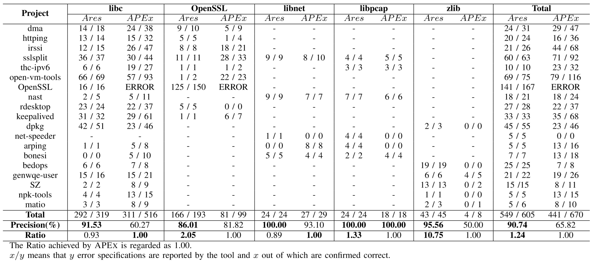

# An Empirical Study of EH-bugs in C programs

### What is in this repo?

- Empirical Study
  - [GitGrabber](empirical_study/Gitgrabber): a tool to extract commits based on the pre-defined keyword matching
  - [Commits](empirical_study/EH_patch): EH-bug fixes in the studied projects (study period from 2014-01-01 to 2019-01-01) 
- Prototype Tool: Ares*
  - Evaluation Process
    - 19 real world projects
  - New bugs found by Ares* 
  - Tools
    - build-capture
    - [Ares* toolkit](tool)

### Empirical Study

To better understand the properties of EH-bugs occur in real C projects, we manually studied six open-source projects within the study period from 2014-01-01 to 2019-01-01, as shown in the following table. These histories are chosen because of the ongoing development and because they are frequently mentioned in diverse bug detection works. In total, we have studied approximately 33.9K commits.

|      Projects      |  Commits |  Candidate EH-bug commits  |  Confirmed EH-bug commits | EH-bug fixes
| :---------------: | ---------: | ---------: | ---------: |---------: 
|      OpenSSL      |     11534 | 262 | 152 | 412
|      Curl       |       6646 | 120 | 56 | 123
|      PostgreSQL        |    10237 |  86 | 21 | 51
|      Open-vm-tools        |    1157 |  8 | 0 | 0
|      keepalived      |      2898 |  36 | 13 | 39  
|     irssi     |      1434 | 12 | 6 | 7
|   Total  |  33906 | 524 | 248 | 632

#### GitGrabber

[GitGrabber](empirical_study/Gitgrabber) is a tool to extract commits based on the pre-defined messgaes.  To help readers extract the commits message, changed files and patch files, we open source our GitGrabber tool. Any problems on GitGrabber, please feel free to contact us!

We describe the [usages](empirical_study/Gitgrabber/README.md) of the tool in detail.  We defined our info at the [config.yml](empirical_study/Gitgrabber/config.yml) file, then GitGrabber can extract the commits that matching our pre-defined info.  First, as shown in the [config.yml](empirical_study/Gitgrabber/config.yml) file, we extracted the bug fix related commits using the pre-defined the keywords (bug, fix, check, issue, mistake, etc.). Then, based on the first iteration results, we then used the keywords (error path, exception handle, error handle, error check, etc.) related to the EH-bug fixing. 

For each extracted commit, we totally collect 4 types of items ([see this example](empirical_study/Example)), including a description file, the source file before patching, the source file after patching, and a diff file that shows the changes of patching.

#### Commits

 We upload all the candidate EH-bugs commits in the studied subjects for further use. Furthermore, we provide a description file that records the confirmed EH-bug commits.  Readers can find them in [EH_patch](empirical_study/EH_patch) folder.  *PS: Due to the upload file size limits, we can't upload all the commits collected from 2014-01-01 to 2019-01-01.*

### Prototype tool: Ares*

We present Ares*, a tool for automatically inferring error handling specifications and detecting EH-bugs for C programs based on static analysis. Ares* is still under development, and contains a lot of bugs and TODO lists. Any bugs or feature requests, feel free to open issues.

#### Evaluation Process

We select 19 widely-used open-source projects:
- [dma](https://github.com/corecode/dma):  an open-source Mail Transport Agent (MTA) designed for home and office use.
- [httping](https://github.com/flok99/httping):  an open-source project that provides the similar 'ping' service but for http-requests.
- [irssi](https://github.com/irssi/irssi):  an open-source modular chat client that is most commonly known for its text mode user interface.
- [sslsplit](https://github.com/droe/sslsplit):  an open-source tool that against man-in-the-middle attacks for SSL/TLS encrypted network connections.
- [thc-ipv6](https://github.com/vanhauser-thc/thc-ipv6):  an THC-IPV6-ATTACK-TOOLKIT.
- [open-vm-tools](https://github.com/vmware/open-vm-tools):  an open-source project that provide a set of services and modules that enable several features in VMware products for better management.
- [openssl](https://github.com/openssl/openssl): a robust, commercial-grade, full-featured Open Source Toolkit for the Transport Layer Security (TLS) protocol formerly known as the Secure Sockets Layer (SSL) protocol.
- [nast](https://www.linuxlinks.com/nast/): Network Analyzer Sniffer Tool (nast) is a packet sniffer and a LAN analyzer based on Libnet and Libpcap, which is a free and open source software.
- [rdesktop](https://github.com/rdesktop/rdesktop): an open source client for Microsoft's RDP protocol.
- [keepalived](https://github.com/acassen/keepalived): an open source project that provides simple and robust facilities for loadbalancing and high-availability to Linux system and Linux based infrastructures.
- [dpkg](https://github.com/guillemj/dpkg): Debian's package maintenance system.
- [net-speeder](https://github.com/snooda/net-speeder): a program to speed up single thread download upon long delay and unstable network.
- [arping](https://github.com/ThomasHabets/arping):  it is a util to find out if a specific IP address on the LAN is 'taken'
and what MAC address owns it.
- [bonesi](https://github.com/Markus-Go/bonesi):  a Tool to simulate Botnet Traffic in a testbed environment on the wire.
- [bedops](https://github.com/bedops/bedops): high-performance genomic feature operations.
- [genwqe-user](https://github.com/ibm-genwqe/genwqe-user): (Generic Work Queue Engine) software supports the IBM PCIe3 FPGA or CAPI Compression Accelerator Adapters to speed up processing of the DEFLATE compression algorithm.
- [SZ](https://github.com/szcompressor/SZ): Error-bounded Lossy Compressor for HPC Data.
- [npk-tools](https://github.com/rsa9000/npk-tools): Mikrotik's NPK files managing tools.
- [matio](https://github.com/tbeu/matio): MATLAB MAT file I/O library.

For each project, Ares* finds EH-specifications using the EH-code structure and the EH-features. These projects are used for comparison with state-of-the-art [APEx](https://github.com/yujokang/APEx) in terms of precision and ratio.  As shown in the following table, Ares* is evaluated on 19 projects from 5 libraries. The results are compared with APEx, and both inferred EH-specifications from APEx and Ares* are verified manually against the official documentation. 

Precision values achieved by Ares* for all libraries are all higher than those achieved by APEx. Ares* has an overall precision of 90.74% while APEx has 65.82%. The improvement is 37.8%. Especially, for the keepalived project in the libc library, our tool finds 32 error specifications and out of which 31 are correct. By contrast, APEx finds 61 error specifications, out of which only 29 are correct. The reason is that the EH-features we used can effectively recognize EH-code. However, APEx identifies EH-code by counting the number of statements, with the belief that error path has fewer statements, which is not accurate enough for EH-code identification. Moreover, it is difficult for APEx to handle the circumstance where EH-code has more statements than regular code, which commonly happens in cleanup functions.

Ares* can also identify more error specifications than APEx. For each library, the ratio ranges from 0.89 to 10.75. The overall ratio is 1.24. Especially, for the zlib library, our tool finds 45 error specifications, out of which 43 are correct. However, APEx only finds 4 correct ones. The number of identified error specifications reported by Ares* for the zlib library exceeds the number reported by APEx 10.75 times.  The reason is that the multiple EH-features adopted by Ares* can identify more EH-code than a single feature used by APEx. 

Furthermore, Ares* is hundred times faster than APEx on most of the evaluated projects. For example, in the keepalived project, Ares* spends 13 seconds in compiling and 14 seconds in analyzing, while APEx spends 1466 seconds in compiling and 14157 seconds in analyzing. Moreover, APEx terminates unexpectedly in the OpenSSL project due to out of memory.



#### New Bugs

The main motivation of Ares* is to infer EH-specifications and using the specifications to detect EH-bugs in real-world programs. Therefore, using the inferred specifications, we have already detected 40 EH-bugs that are confirmed by developers. Note that, sometimes we report several bugs in an issue.

|      Project      | Bugs
| :---------------: | ---------:
|      keepalived   | https://github.com/acassen/keepalived/issues/1003
|      keepalived   | https://github.com/acassen/keepalived/issues/1004
|      dma          | https://github.com/corecode/dma/issues/59
|      httping      | https://github.com/flok99/httping/issues/41
|      sslsplit     | https://github.com/droe/sslsplit/issues/224
|      sslsplit     | https://github.com/droe/sslsplit/issues/225
|      thc-ipv6     | https://github.com/vanhauser-thc/thc-ipv6/issues/28
|      thc-ipv6     | https://github.com/vanhauser-thc/thc-ipv6/issues/29
|      open-vm-tools| https://github.com/vmware/open-vm-tools/issues/291
|      open-vm-tools| https://github.com/vmware/open-vm-tools/issues/292
|      irssi        | https://github.com/irssi/irssi/issues/943
|      rdesktop     | https://github.com/rdesktop/rdesktop/issues/280
|      rdesktop     | https://github.com/rdesktop/rdesktop/issues/281
|      matio        | https://github.com/tbeu/matio/issues/145
|      matio        | https://github.com/tbeu/matio/issues/146
|      openssl      | https://github.com/openssl/openssl/issues/12471
|      openssl      | https://github.com/openssl/openssl/issues/12578
|      openssl      | https://github.com/openssl/openssl/issues/6567
|      openssl      | https://github.com/openssl/openssl/issues/6569
|      openssl      | https://github.com/openssl/openssl/issues/6575
|      openssl      | https://github.com/openssl/openssl/issues/6572
|      openssl      | https://github.com/openssl/openssl/issues/6574
|      openssl      | https://github.com/openssl/openssl/issues/6983
|      openssl      | https://github.com/openssl/openssl/issues/7235
|      openssl      | https://github.com/openssl/openssl/issues/6982
|      openssl      | https://github.com/openssl/openssl/issues/6983
|      openssl      | https://github.com/openssl/openssl/issues/6973
|      openssl      | https://github.com/openssl/openssl/issues/6789
|      openssl      | https://github.com/openssl/openssl/issues/6820
|      openssl      | https://github.com/openssl/openssl/issues/6822
|      openssl      | https://github.com/openssl/openssl/issues/6570


### Tools

#### build-capture

Build capture tool is designed for capturing the build process of a Makefile project. Basically, it will save all the single lines of $CC$ and re-make the project to produce all the intermediate results.

That is, we can produce all the *.i files, which is a self-contained preprocessed files. Then for each *.i files, we can generate the LLVM-IR files clang. For example, 

```shell
$gcc -E example.c -o exmaple.i
$clang-3.9 -S -emit-llvm -g example.i
```


In theory, any projects supported by clang can be build-capture by our tool. However, clang is different from gcc. Therefore, we suggest to replace the $CC$ in Makefile by clang-3.9, such as

```makefile
CROSS_COMPILE=
CC=$(CROSS_COMPILE)clang
```

In this way, all the *.i files can be compiled by clang to generate LLVM-IR files. 

For multiple LLVM-IR files, use the following command to combine them and use as our tool,

```shell
llvm-link a.ll b.ll -o output.bc
llvm-dis output.bc -o input4engine.ll
```

Unfortunately, build-capture tool is under the patient application process. Therefore, we cannot provide the tool here. When available, we will upload ASAP.


#### Ares* toolkit

Ares* can be used with the following steps: 
  - Ares* requires the Unix environment (Our environment is Ubuntu 16.04) with JDK 1.8.
  - Ares* requires the llvm-3.9 - for static analysis [We build our tool on llvm-3.9, other version may face some unpredictable problems.]
  - Make sure that target project can be compiled by clang-3.9, then using our build-capture tool to capture its build sequence automatically. The captured results are preprocessed by expanding the macros and in-lining header files. Then using the captured results, we can generate the corresponding IR results which are shown in [Real-World-Projects](evaluation_data/Real-World-Projects).
  - Trigger the major work using the command "[./infer-spec.sh](tool) [Source_Dir]". Source_Dir is the target project to be analyzed where you can find in the [Real-World-Projects](evaluation_data/Real-World-Projects). 
